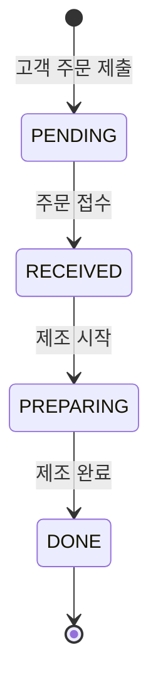

# PRD — 관리자 화면

| 항목 | 내용 |
|------|------|
| 문서 버전 | 1.0 |
| 대상 화면 | 관리자 |
| 앱 구성 | 주문하기 · 관리자 (본 문서는 **관리자**만 다룸) |
| 브랜드명 | COZY |
| 연관 문서 | [PRD — 주문하기 화면](./PRD.md) |
| 최종 수정일 | 2026-05-31 |

---

## 1. 개요

### 1.1 배경

관리자 화면은 매장 직원이 **주문 현황을 확인·처리**하고 **메뉴별 재고를 조정**하는 운영용 UI이다. 고객이 [주문하기](./PRD.md) 화면에서 제출한 주문이 이 화면에 표시되며, 직원은 상태를 단계적으로 변경한다.

### 1.2 목표

- 한 화면에서 주문 처리 현황(대시보드)을 파악한다.
- 메뉴별 재고 수량을 +/- 로 즉시 조정한다.
- 주문 목록을 시간순으로 보고, 단계별 액션 버튼으로 상태를 진행한다.
- 헤더를 통해 **주문하기** 화면으로 돌아갈 수 있다.

### 1.3 성공 지표 (참고)

- 신규 주문 발생 후 관리자 화면 목록·대시보드에 즉시(또는 폴링 5초 이내) 반영
- 재고 0 이하로 내려가지 않음
- 주문 상태 전이가 대시보드 집계와 항상 일치

---

## 2. 사용자 및 시나리오

### 2.1 주요 사용자

| 역할 | 설명 |
|------|------|
| 매장 직원 / 관리자 | 주문 접수·제조 진행·완료 처리 및 재고 관리 |

### 2.2 핵심 시나리오

1. 직원이 관리자 화면에 진입한다.
2. **관리자 대시보드**에서 총 주문·단계별 건수를 확인한다.
3. **재고 현황**에서 품목별 수량을 +/- 로 조정한다.
4. **주문 현황**에서 신규 주문을 확인하고 **주문 접수** 등 단계 버튼을 눌러 처리한다.
5. 필요 시 헤더 **주문하기**로 고객 화면으로 이동한다.

---

## 3. 화면 구조

와이어프레임 기준 레이아웃은 **헤더 → 관리자 대시보드 → 재고 현황 → 주문 현황**의 네 영역으로 세로 배치한다.

```
┌─────────────────────────────────────────────────────────┐
│  COZY                          주문하기  [관리자]        │  ← Header
├─────────────────────────────────────────────────────────┤
│  관리자 대시보드                                         │
│  총 주문 N / 주문 접수 N / 제조 중 N / 제조 완료 N       │  ← Dashboard
├─────────────────────────────────────────────────────────┤
│  재고 현황                                               │
│  ┌─────────┐  ┌─────────┐  ┌─────────┐                 │  ← Inventory
│  │ 메뉴 A   │  │ 메뉴 B   │  │ 메뉴 C   │  [-] [+]        │
│  └─────────┘  └─────────┘  └─────────┘                 │
├─────────────────────────────────────────────────────────┤
│  주문 현황                                               │
│  시각 · 품목 · 금액                    [단계 액션 버튼]   │  ← Order List
└─────────────────────────────────────────────────────────┘
```

### 3.1 반응형 (권장)

| 뷰포트 | 재고 카드 | 주문 행 |
|--------|-----------|---------|
| 모바일 | 1열 | 세로 스택(시각 → 품목 → 금액 → 버튼) |
| 태블릿 이상 | 3열 (와이어프레임) | 가로 한 줄 정렬 |

---

## 4. UI 구성 요소

### 4.1 헤더 (Header)

주문하기 화면과 동일한 글로벌 헤더. **현재 화면이 관리자**이므로 활성 표시는 **관리자**에 적용한다.

| 요소 | 타입 | 설명 |
|------|------|------|
| COZY | 텍스트/로고 | 좌측 브랜드 |
| 주문하기 | 링크/버튼 | `/` 또는 주문하기 경로로 이동 |
| 관리자 | 버튼 또는 탭 | 현재 화면. 활성 상태 시각적 구분(와이어프레임: 테두리/박스) |

**동작**

- **주문하기** 선택 시 주문하기 화면으로 라우팅.
- **관리자**는 현재 페이지이므로 활성 스타일만 적용.

---

### 4.2 관리자 대시보드 (Admin Dashboard)

| 요소 | 설명 |
|------|------|
| 섹션 제목 | **관리자 대시보드** |
| 지표 한 줄 | `총 주문 N / 주문 접수 N / 제조 중 N / 제조 완료 N` (슬래시 구분) |

#### 4.2.1 지표 정의

| 지표 | 의미 | 집계 규칙 |
|------|------|-----------|
| **총 주문** | 시스템에 존재하는 전체 주문 건수 | 모든 상태 포함(취소 제외 시 취소 건 제외) |
| **주문 접수** | 접수 대기 또는 접수 완료 직후·제조 전 단계 | 상태 = `RECEIVED` (아래 §5.1) |
| **제조 중** | 제조 진행 중 | 상태 = `PREPARING` |
| **제조 완료** | 제조 완료(픽업·전달 대기 포함 가능) | 상태 = `DONE` |

> 와이어프레임 예시: `총 주문 1 / 주문 접수 1 / 제조 중 0 / 제조 완료 0` — 신규 주문 1건이 **주문 접수** 단계에 있음을 의미.

#### 4.2.2 갱신

- 주문 상태 변경·신규 주문·주문 삭제(있다면) 시 **실시간 재계산**.
- MVP: 공유 스토어 구독 또는 주기적 refetch(예: 3~5초).

---

### 4.3 재고 현황 (Inventory Status)

| 요소 | 설명 |
|------|------|
| 섹션 제목 | **재고 현황** |
| 카드 | 메뉴당 1카드, 가로 배치 |

#### 4.3.1 카드 구성

| 영역 | 설명 |
|------|------|
| 메뉴명 | 예: 아메리카노 (ICE), 아메리카노 (HOT), 카페라떼 |
| 수량 | `N개` 형식 (예: 10개) |
| **−** 버튼 | 재고 1 감소 |
| **+** 버튼 | 재고 1 증가 |

#### 4.3.2 초기 재고 (MVP)

| 메뉴 (표시명) | menuItemId (권장) | 초기 수량 |
|---------------|-------------------|-----------|
| 아메리카노 (ICE) | `americano-ice` | 10 |
| 아메리카노 (HOT) | `americano-hot` | 10 |
| 카페라떼 | `cafe-latte` | 10 |

주문하기 PRD의 메뉴 ID와 **동일 키**로 매핑한다. 화면 표기는 괄호·공백 차이만 허용(예: `아메리카노(ICE)` ↔ `아메리카노 (ICE)`).

#### 4.3.3 동작 규칙

- **+** 클릭: `quantity += 1`, UI 즉시 반영.
- **−** 클릭: `quantity > 0` 일 때만 `quantity -= 1`. **0이면 − 비활성** 또는 클릭 무시.
- 상한: MVP에서는 상한 없음(또는 999 상한 — 구현 선택).
- 주문하기 화면과 **재고 연동**(선택, 권장):
  - 고객 **담기/주문** 시 재고 차감은 MVP **필수 아님**.
  - 2차: 주문 **접수** 시 해당 품목 수량만큼 자동 차감.

---

### 4.4 주문 현황 (Order Status)

| 요소 | 설명 |
|------|------|
| 섹션 제목 | **주문 현황** |
| 주문 행 | 시간 · 품목 요약 · 주문 금액 · **액션 버튼** |

#### 4.4.1 주문 행 레이아웃 (와이어프레임)

| 열 | 예시 | 설명 |
|----|------|------|
| 주문 시각 | `7월 31일 13:00` | `M월 D일 HH:mm` (24시간, 한국어) |
| 품목 요약 | `아메리카노(ICE) x 1` | 복수 품목 시 `, ` 로 이어 붙임 |
| 금액 | `4,000원` | 주문 **총액** (천 단위 쉼표) |
| 액션 | `주문 접수` | 현재 상태에 따른 CTA (§4.4.2) |

**품목 요약 형식**

- 단일: `{상품명} x {수량}`
- 옵션 포함(주문하기와 동일): `아메리카노(ICE) (샷 추가) x 1`
- 복수: `아메리카노(ICE) x 1, 아메리카노(HOT) x 2`

#### 4.4.2 주문 상태 및 액션 버튼

고객이 주문하기에서 제출하면 초기 상태는 **`PENDING`**(또는 `PLACED`)이며, 관리자 목록에 노출되고 버튼은 **주문 접수**이다.

| 상태 코드 | 표시명 (내부) | 행 우측 버튼 라벨 | 버튼 클릭 후 다음 상태 |
|-----------|---------------|-------------------|-------------------------|
| `PENDING` | 신규(접수 전) | **주문 접수** | `RECEIVED` |
| `RECEIVED` | 주문 접수됨 | **제조 시작** | `PREPARING` |
| `PREPARING` | 제조 중 | **제조 완료** | `DONE` |
| `DONE` | 제조 완료 | 버튼 없음 또는 **완료** (비활성) | — |

> 와이어프레임에는 **주문 접수** 버튼만 표기. MVP 구현 시 위 **4단계 전이**를 권장하며, 대시보드의 「주문 접수 / 제조 중 / 제조 완료」 건수가 각 상태와 1:1로 맞아야 한다.

**`PENDING` vs 대시보드 「주문 접수」**

- 와이어 예시(총 1, 주문 접수 1): 신규 1건을 대시보드 **주문 접수**에 포함하는 정책을 채택한다.
- 즉 `PENDING` + `RECEIVED` 를 합산해 「주문 접수」로 표시할지, `PENDING`만 표시할지는 팀 선택.
- **권장**: `PENDING` → 대시보드 「주문 접수」에 포함(직원이 처리할 대기 건).

#### 4.4.3 목록 정렬·필터

- **정렬**: 주문 시각 **오름차순**(오래된 것 먼저) 또는 **내림차순**(최신 우선). MVP 권장: **오래된 미처리 우선**(FIFO).
- **필터**: MVP는 전체 표시. 2차: 「완료 숨기기」 토글.

#### 4.4.4 빈 상태

- 주문이 없으면 「접수된 주문이 없습니다」 등 안내 문구 표시.

---

## 5. 데이터 모델 및 연동

### 5.1 주문 상태 (OrderStatus)

```ts
type OrderStatus = 'PENDING' | 'RECEIVED' | 'PREPARING' | 'DONE';

interface Order {
  id: string;
  items: CartLine[];      // 주문하기 PRD CartLine과 동일
  totalAmount: number;
  orderedAt: string;      // ISO 8601
  status: OrderStatus;
}
```

### 5.2 재고 (InventoryItem)

```ts
interface InventoryItem {
  menuItemId: string;
  name: string;           // 표시용
  quantity: number;
}
```

### 5.3 대시보드 집계 (DashboardStats)

```ts
interface DashboardStats {
  total: number;
  received: number;       // PENDING + RECEIVED (권장 정책, §4.2.1)
  preparing: number;      // PREPARING
  done: number;           // DONE
}
```

### 5.4 주문하기 화면과의 연동

| 이벤트 | 관리자 화면 동작 |
|--------|------------------|
| 고객 주문 제출 | `Order` 생성, `status: PENDING`, 주문 현황·대시보드 갱신 |
| 직원 상태 버튼 클릭 | `PATCH /api/orders/:id/status` 또는 공유 스토어 업데이트 |
| 재고 +/- | `PATCH /api/inventory/:menuItemId` 또는 로컬 스토어 |

MVP(백엔드 없음): `localStorage` / Context / Zustand 등 **단일 소스**로 주문·재고 공유.

### 5.5 API (참고)

| 메서드 | 경로 | 설명 |
|--------|------|------|
| GET | `/api/orders` | 주문 목록 |
| PATCH | `/api/orders/:id/status` | `{ status: OrderStatus }` |
| GET | `/api/inventory` | 재고 목록 |
| PATCH | `/api/inventory/:menuItemId` | `{ quantity: number }` |
| GET | `/api/admin/stats` | 대시보드 집계(또는 프론트에서 orders로 derive) |

---

## 6. 상태 및 예외 처리

### 6.1 화면 상태

| 상태 | 설명 |
|------|------|
| loading | 주문·재고 초기 로드 |
| ready | 대시보드·재고·주문 목록 표시 |
| updating | 상태 변경·재고 조정 중 (버튼 로딩) |
| error | 로드/저장 실패 |

### 6.2 예외 케이스

| 상황 | 기대 동작 |
|------|-----------|
| 주문 목록 로드 실패 | 에러 메시지 + 재시도 |
| 상태 변경 실패 | 이전 상태 유지, 토스트 안내 |
| 재고 0에서 − 클릭 | 무시 또는 버튼 비활성 |
| 동시에 두 탭에서 재고 수정 | 마지막 쓰기 우선 또는 서버 버전 충돌 처리(2차) |

---

## 7. 접근성 및 UX (권장)

- +/- 버튼에 `aria-label` (예: 「아메리카노 ICE 재고 증가」)
- 주문 행 액션 버튼은 상태명을 라벨에 포함(예: 「7월 31일 13:00 주문, 주문 접수」)
- 대시보드 숫자 변경 시 `aria-live="polite"` 로 스크린 리더 알림(선택)
- 터치 타깃 최소 44×44px

---

## 8. 비기능 요구사항

| 항목 | 요구 |
|------|------|
| 언어 | UI 문구 한국어 |
| 통화 | 원(KRW), 정수 |
| 실시간성 | MVP: 수동 새로고침 또는 3~5초 폴링; 이상: WebSocket/SSE |
| 브라우저 | 최신 Chrome, Safari, Edge |
| 인증 | MVP: 없음(매장 내부망 가정). 2차: PIN/로그인 |

---

## 9. 범위

### 9.1 포함 (In Scope)

- 헤더(관리자 활성, 주문하기 이동)
- 관리자 대시보드 4종 지표
- 재고 현황 3메뉴, +/- 조정
- 주문 현황 목록, 상태별 액션 버튼(4단계 전이)
- 주문하기 화면과 주문 데이터 공유

### 9.2 제외 (Out of Scope)

- 로그인·권한·감사 로그
- 주문 취소·환불
- 매출 통계·기간별 리포트
- 푸시 알림
- 메뉴 추가/가격 수정(메뉴 마스터 관리)
- 주문 검색·페이지네이션(주문 수 소량 MVP)

---

## 10. 수용 기준 (Acceptance Criteria)

- [ ] 헤더에 COZY, 주문하기 링크, 관리자(활성)가 표시된다.
- [ ] 관리자 대시보드에 총 주문 / 주문 접수 / 제조 중 / 제조 완료가 슬래시 형식으로 표시된다.
- [ ] 지표 숫자는 실제 주문 상태 집계와 일치한다.
- [ ] 재고 현황에 MVP 메뉴 3종이 카드로 표시되고, 각각 `N개`와 −/+ 버튼이 있다.
- [ ] − 클릭 시 0 미만으로 내려가지 않는다.
- [ ] + 클릭 시 수량이 1 증가한다.
- [ ] 주문하기에서 제출한 주문이 주문 현황에 시각·품목·총액과 함께 나타난다.
- [ ] 신규 주문 행에 **주문 접수** 버튼이 보이고, 클릭 시 다음 단계로 전이된다.
- [ ] 상태 전이 후 대시보드·버튼 라벨이 갱신된다.
- [ ] **주문하기** 클릭 시 주문하기 화면으로 이동한다.
- [ ] 와이어프레임 예시 행(7월 31일 13:00 · 아메리카노(ICE) x 1 · 4,000원 · 주문 접수)을 재현할 수 있다.

---

## 11. 와이어프레임 참조

- 상단: COZY · 주문하기 · **관리자**(활성)
- 관리자 대시보드: `총 주문 1 / 주문 접수 1 / 제조 중 0 / 제조 완료 0`
- 재고 현황: 3카드, 각 10개, − / +
- 주문 현황: 1행 — `7월 31일 13:00` · `아메리카노(ICE) x 1` · `4,000원` · `[주문 접수]`

---

## 12. 주문 상태 흐름 (참고 다이어그램)


