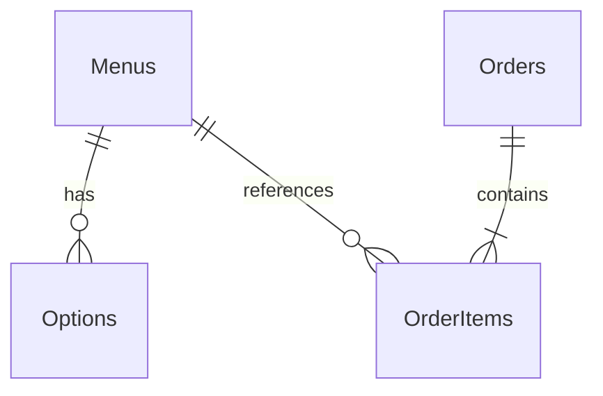

# PRD — 주문하기 화면

| 항목 | 내용 |
|------|------|
| 문서 버전 | 1.1 |
| 대상 | 주문하기 화면(프론트) · 백엔드(데이터·API) |
| 앱 구성 | 주문하기 · 관리자 |
| 브랜드명 | COZY |
| 최종 수정일 | 2026-05-31 |

---

## 1. 개요

### 1.1 배경

COZY는 카페 메뉴를 고객이 직접 선택·옵션 지정·장바구니에 담아 주문할 수 있는 웹 기반 주문 화면이다. 매장 직원 또는 키오스크 대신 고객이 스스로 주문하는 **셀프 오더(Self-order)** 흐름을 전제로 한다.

### 1.2 목표

- 메뉴를 한눈에 보고 옵션을 선택한 뒤 장바구니에 담을 수 있다.
- 장바구니 내역과 총 금액을 확인한 후 한 번에 주문을 제출할 수 있다.
- 헤더를 통해 **관리자** 화면으로 이동할 수 있다(관리자 화면 상세는 별도 PRD).

### 1.3 성공 지표 (참고)

- 메뉴 선택부터 주문 제출까지 3탭 이내 완료 가능
- 옵션·수량·금액 불일치 없이 주문 데이터가 서버(또는 관리자 화면)에 전달됨

---

## 2. 사용자 및 시나리오

### 2.1 주요 사용자

| 역할 | 설명 |
|------|------|
| 고객 | 매장에서 음료를 주문하는 일반 사용자 |

### 2.2 핵심 시나리오

1. 고객이 주문하기 화면에 진입한다.
2. 원하는 메뉴의 옵션(샷 추가, 시럽 추가)을 선택한다.
3. **담기**를 눌러 장바구니에 추가한다.
4. 장바구니에서 품목·수량·금액을 확인한다.
5. **주문하기**를 눌러 주문을 완료한다.

---

## 3. 화면 구조

와이어프레임 기준 레이아웃은 **상단 고정 헤더 → 메뉴 그리드 → 하단 장바구니 패널**의 세 영역으로 구성한다.

```
┌─────────────────────────────────────────────────────────┐
│  COZY                          [주문하기]  관리자        │  ← Header
├─────────────────────────────────────────────────────────┤
│  ┌──────────┐  ┌──────────┐  ┌──────────┐              │
│  │  메뉴 1   │  │  메뉴 2   │  │  메뉴 3   │   ...        │  ← Product Grid
│  └──────────┘  └──────────┘  └──────────┘              │
├─────────────────────────────────────────────────────────┤
│  장바구니                                                │
│  · 품목 목록                          총 금액 · [주문하기] │  ← Cart Footer
└─────────────────────────────────────────────────────────┘
```

### 3.1 반응형 (권장)

| 뷰포트 | 메뉴 그리드 |
|--------|-------------|
| 모바일 | 1열 |
| 태블릿 | 2열 |
| 데스크톱 | 3열 이상 (와이어프레임: 3열) |

장바구니는 스크롤 시에도 접근 가능하도록 **하단 고정(sticky/fixed)** 또는 뷰포트 하단에 배치하는 것을 권장한다.

---

## 4. UI 구성 요소

### 4.1 헤더 (Header)

| 요소 | 타입 | 설명 |
|------|------|------|
| COZY | 텍스트/로고 | 좌측 브랜드 표시. 클릭 시 주문하기 화면 최상단으로 스크롤 또는 새로고침(정책 선택) |
| 주문하기 | 버튼 또는 탭 | 현재 화면. 활성 상태 시각적 구분(와이어프레임: 박스/강조) |
| 관리자 | 링크/버튼 | 관리자 화면으로 라우팅 |

**동작**

- **관리자** 선택 시 `/admin`(또는 동등 경로)로 이동.
- **주문하기**는 현재 페이지이므로 비활성 또는 현재 위치 표시만 수행.

---

### 4.2 메뉴 카드 (Product Card)

각 카드는 동일한 구조를 가진다.

| 영역 | 설명 |
|------|------|
| 상품 이미지 | 정사각형 영역. 이미지 없을 때 플레이스홀더 표시 |
| 상품명 | 굵은 제목 (예: 아메리카노(ICE)) |
| 가격 | 기본 가격, 원 단위, 천 단위 구분 쉼표 (예: 4,000원) |
| 설명 | 한 줄 요약 (예: 간단한 설명...) |
| 옵션 | 체크박스 목록 |
| 담기 | 카드 하단 전체 너비 버튼 |

#### 4.2.1 초기 메뉴 데이터 (MVP)

| 상품명 | 기본 가격 | 옵션 |
|--------|-----------|------|
| 아메리카노(ICE) | 4,000원 | 샷 추가 (+500원), 시럽 추가 (+0원) |
| 아메리카노(HOT) | 4,000원 | 동일 |
| 카페라떼 | 5,000원 | 동일 |

> 추후 메뉴는 API 또는 설정으로 확장 가능. MVP는 위 3종 고정 또는 JSON/목 데이터로 관리.

#### 4.2.2 옵션 규칙

| 옵션명 | 추가 금액 | 다중 선택 |
|--------|-----------|-----------|
| 샷 추가 | +500원 | 가능 (체크 시 1회만 적용) |
| 시럽 추가 | +0원 | 가능 |

- 옵션은 **해당 카드에서만** 선택하며, **담기** 시점의 체크 상태가 장바구니 품목에 반영된다.
- **담기** 후 카드의 옵션 체크박스는 **초기화**(unchecked)하여 연속 담기 시 이전 옵션이 남지 않게 한다.

#### 4.2.3 담기 버튼

- 클릭 시 현재 카드의 상품 + 선택된 옵션을 장바구니에 **수량 1**로 추가한다.
- 동일 상품 + **동일 옵션 조합**이 이미 있으면 수량을 **+1**한다(별도 라인을 만들지 않음).
- 피드백: 토스트/짧은 애니메이션 등으로 “담았습니다” 표시(선택 사항, UX 권장).

---

### 4.3 장바구니 (Shopping Cart)

하단 넓은 영역(와이어프레임: 둥근 모서리 컨테이너).

| 영역 | 설명 |
|------|------|
| 제목 | **장바구니** (좌상단) |
| 품목 목록 | 각 줄: `상품명 (옵션 요약) X 수량` · 우측 **소계** |
| 총 금액 | 우측 **총 금액 N원** |
| 주문하기 | 총 금액 아래 큰 CTA 버튼 |

#### 4.3.1 품목 표시 형식

- 옵션이 있는 경우 괄호로 표기: `아메리카노(ICE) (샷 추가) X 1`
- 옵션이 없으면 괄호 생략: `아메리카노(HOT) X 2`
- 여러 옵션 선택 시: `아메리카노(ICE) (샷 추가, 시럽 추가) X 1` (쉼표 구분, 표시 순서는 옵션 정의 순)

#### 4.3.2 금액 계산

```
품목 단가 = 기본 가격 + Σ(선택 옵션 추가 금액)
소계 = 품목 단가 × 수량
총 금액 = Σ(소계)
```

**와이어프레임 예시 검증**

| 품목 | 계산 | 소계 |
|------|------|------|
| 아메리카노(ICE) (샷 추가) × 1 | 4,000 + 500 | 4,500원 |
| 아메리카노(HOT) × 2 | 4,000 × 2 | 8,000원 |
| **합계** | | **12,500원** |

#### 4.3.3 주문하기 버튼

- 장바구니가 **비어 있으면** 비활성(disabled) 또는 클릭 시 “담은 메뉴가 없습니다” 안내.
- 클릭 시 주문 payload 생성 후 제출(아래 §5).
- 제출 성공 시: 장바구니 비우기 + 완료 메시지(모달/토스트). 실패 시: 에러 메시지, 장바구니 유지.

#### 4.3.4 MVP에서 제외 가능한 기능

와이어프레임에 없으나 이후 확장 시 고려:

- 품목별 수량 +/- 버튼
- 품목 삭제
- 장바구니 전체 비우기

MVP는 **담기로만 수량 증가**, 삭제/감소는 2차 스펙으로 분리 가능.

---

## 5. 데이터 및 API (프론트 관점)

### 5.1 메뉴 (MenuItem)

```ts
interface MenuOption {
  id: string;
  name: string;        // 예: "샷 추가"
  price: number;       // 추가 금액 (0 가능)
}

interface MenuItem {
  id: string;
  name: string;
  basePrice: number;
  description: string;
  imageUrl?: string;
  options: MenuOption[];
}
```

### 5.2 장바구니 품목 (CartLine)

```ts
interface CartLine {
  menuItemId: string;
  name: string;
  selectedOptionIds: string[];
  unitPrice: number;   // 계산된 단가
  quantity: number;
  lineTotal: number;   // unitPrice * quantity
}
```

### 5.3 주문 제출 (OrderPayload)

```ts
interface OrderPayload {
  items: CartLine[];
  totalAmount: number;
  orderedAt: string;   // ISO 8601
}
```

- POST `/api/orders` 등 백엔드 연동 시 위 구조 사용(엔드포인트는 백엔드 PRD와 합의).
- 백엔드 없이 MVP인 경우: `localStorage` 또는 in-memory + 관리자 화면과 공유 스토어.

---

## 6. 상태 및 예외 처리

### 6.1 화면 상태

| 상태 | 설명 |
|------|------|
| idle | 메뉴 표시, 장바구니 대기 |
| cart_updated | 담기 후 장바구니 갱신 |
| ordering | 주문 제출 중 (버튼 로딩, 중복 클릭 방지) |
| order_success | 주문 완료 |
| order_error | 제출 실패 |

### 6.2 예외 케이스

| 상황 | 기대 동작 |
|------|-----------|
| 장바구니 비운 상태에서 주문하기 | 버튼 비활성 또는 안내 메시지 |
| 네트워크 오류 | 에러 메시지, 재시도 가능 |
| 이미지 로드 실패 | 플레이스홀더 유지 |
| 메뉴 목록 로드 실패 | 빈 상태 + 재시도 UI |

---

## 7. 접근성 및 UX (권장)

- 모든 버튼·체크박스에 키보드 포커스 및 `aria-label` 제공
- 가격·총액은 스크린 리더에서 “사천 원” 등으로 읽히도록 `aria-live` 영역에 총액 반영(선택)
- 터치 타깃 최소 44×44px
- 색상만으로 상태 구분하지 않음 (활성 탭, 비활성 버튼에 텍스트/테두리 병행)

---

## 8. 비기능 요구사항

| 항목 | 요구 |
|------|------|
| 언어 | UI 문구 한국어 |
| 통화 | 원(KRW), 정수 원 단위 |
| 성능 | 메뉴 20종 이하 기준 초기 렌더 1초 이내(로컬 데이터) |
| 브라우저 | 최신 Chrome, Safari, Edge (모바일 포함) |

---

## 9. 범위

### 9.1 포함 (In Scope)

- 헤더: COZY, 주문하기(현재), 관리자 링크
- 메뉴 카드 그리드, 옵션, 담기
- 장바구니 목록·소계·총액·주문하기 CTA
- 동일 메뉴+옵션 수량 병합
- 주문 제출 및 완료/실패 처리

### 9.2 제외 (Out of Scope) — 본 PRD

- **관리자** 화면 상세 (별도 PRD)
- 결제 PG 연동
- 로그인/회원
- 주문 내역 조회(고객)
- 재고 실시간 연동
- 장바구니 품목 삭제·수량 감소 (MVP 미포함, §4.3.4)

---

## 10. 수용 기준 (Acceptance Criteria)

- [ ] 헤더에 COZY, 주문하기(활성), 관리자 링크가 표시된다.
- [ ] MVP 메뉴 3종이 카드 형태로 표시되며 가격·설명·옵션이 보인다.
- [ ] 옵션 선택 후 **담기** 시 장바구니에 반영되고, 카드 옵션은 초기화된다.
- [ ] 동일 메뉴+동일 옵션 재담기 시 수량만 증가한다.
- [ ] 장바구니 각 줄에 소계가 표시되고, 총 금액이 모든 소계의 합과 일치한다.
- [ ] 와이어프레임 예시(4,500 + 8,000 = 12,500)와 동일한 계산 로직을 따른다.
- [ ] 장바구니가 비어 있을 때 주문하기는 진행되지 않는다.
- [ ] 주문하기 성공 시 장바구니가 비워지고 사용자에게 완료가 안내된다.
- [ ] **관리자** 클릭 시 관리자 화면으로 이동한다.

---

## 11. 와이어프레임 참조

본 PRD는 첨부 와이어프레임(주문하기 화면)을 기준으로 작성되었다.

- 상단: COZY · 주문하기 · 관리자
- 중단: 메뉴 카드 3열 (아메리카노 ICE/HOT, 카페라떼)
- 하단: 장바구니 + 총 금액 + 주문하기 버튼

---

## 12. 연관 문서

| 문서 | 상태 |
|------|------|
| [PRD — 관리자 화면](./PRD-admin.md) | 작성 완료 |
| 백엔드 API·데이터 모델 | 본 문서 §13~§16 |

---

# Part 2. 백엔드 PRD

COZY 주문 앱의 **서버·데이터베이스·API** 요구사항이다. 프론트엔드(MVP)는 현재 `localStorage`로 동작하며, 본 스펙에 맞춰 API 서버를 구축하면 교체·연동한다.

---

## 13. 데이터 모델

### 13.1 Menus (메뉴)

| 필드 | 타입 | 필수 | 설명 |
|------|------|------|------|
| `id` | string (PK) | O | 메뉴 고유 ID (예: `americano-ice`) |
| `name` | string | O | 커피 이름 (예: 아메리카노(ICE)) |
| `description` | string | O | 설명 |
| `price` | integer | O | 기본 가격(원, 정수) |
| `image_url` | string | O | 이미지 URL 또는 정적 경로 |
| `stock_quantity` | integer | O | 재고 수량 (0 이상) |
| `created_at` | timestamp | O | 생성 시각 |
| `updated_at` | timestamp | O | 수정 시각 |

**노출 규칙**

- **주문하기(고객) 화면**: `stock_quantity`는 API 응답에서 **제외**하거나 null — 재고는 고객에게 보이지 않음.
- **관리자 화면**: 재고 수량 표시·수정 가능.

### 13.2 Options (옵션)

| 필드 | 타입 | 필수 | 설명 |
|------|------|------|------|
| `id` | string (PK) | O | 옵션 ID (예: `shot`) |
| `name` | string | O | 옵션 이름 (예: 샷 추가) |
| `price` | integer | O | 옵션 추가 가격(원) |
| `menu_id` | string (FK) | O | 연결할 메뉴 (`Menus.id`) |
| `created_at` | timestamp | O | 생성 시각 |

- 하나의 메뉴에 여러 옵션을 연결할 수 있다 (1:N).
- 동일 옵션 정의를 여러 메뉴에 쓸 경우 메뉴마다 행을 두거나, 공통 옵션 테이블 + `menu_options` 조인 테이블로 확장 가능.

### 13.3 Orders (주문)

| 필드 | 타입 | 필수 | 설명 |
|------|------|------|------|
| `id` | string (PK) | O | 주문 ID (UUID 등) |
| `ordered_at` | timestamp | O | 주문 일시 |
| `total_amount` | integer | O | 주문 총액(원) |
| `status` | enum | O | 주문 상태 (§13.4) |
| `created_at` | timestamp | O | 레코드 생성 시각 |
| `updated_at` | timestamp | O | 상태 변경 시각 |

### 13.4 OrderItems (주문 상세)

주문 내용(메뉴·수량·옵션·금액)은 정규화하여 저장한다.

| 필드 | 타입 | 필수 | 설명 |
|------|------|------|------|
| `id` | string (PK) | O | 주문 상세 ID |
| `order_id` | string (FK) | O | `Orders.id` |
| `menu_id` | string (FK) | O | 메뉴 ID |
| `menu_name` | string | O | 주문 시점 메뉴명(스냅샷) |
| `quantity` | integer | O | 수량 |
| `unit_price` | integer | O | 단가(기본가+옵션 합) |
| `line_total` | integer | O | 소계 |
| `options_json` | json / text | O | 선택 옵션 목록 `[{ id, name, price }]` |

### 13.5 OrderStatus (주문 상태)

| 코드 | 표시명 | 설명 |
|------|--------|------|
| `PENDING` | (신규) | 고객이 방금 제출. 관리자 미처리 |
| `RECEIVED` | 주문 접수 | 접수 완료 (기본 목표 상태) |
| `PREPARING` | 제조 중 | 제조 진행 |
| `DONE` | 완료 | 제조·전달 완료 |

**상태 전이 (관리자)**

```
PENDING ──[주문 접수]──► RECEIVED ──[제조 시작]──► PREPARING ──[제조 완료]──► DONE
```

> 요구사항상 「주문 접수 → 제조 중 → 완료」 흐름에 맞추며, 고객 제출 직후 `PENDING`을 두면 [관리자 PRD](./PRD-admin.md)와 동일하게 **주문 접수** 버튼으로 `RECEIVED`로 전이한다. 백엔드만 단순화할 경우 주문 생성 시 곧바로 `RECEIVED`로 저장해도 된다.

### 13.6 ER 관계 (요약)



---

## 14. 데이터 스키마 — 사용자 흐름

| 단계 | 주체 | 동작 | 데이터 처리 |
|------|------|------|-------------|
| 1 | 고객 | **주문하기** 화면 진입 | `Menus`(+ `Options`) 조회 → 브라우저에 메뉴·옵션 표시. **재고는 응답에 포함하지 않음** |
| 2 | 고객 | 메뉴·옵션 선택 후 장바구니에 담기 | 클라이언트 장바구니 상태(세션/메모리). DB 저장 없음 |
| 3 | 고객 | 장바구니 **주문하기** 클릭 | `Orders` + `OrderItems` INSERT. `ordered_at`, 메뉴·수량·옵션·금액 저장. **메뉴 재고 차감** (§16.3) |
| 4 | 관리자 | **주문 현황** 조회 | `Orders` 목록 표시. 기본 표시 상태 **주문 접수**(`PENDING` 또는 `RECEIVED`) |
| 5 | 관리자 | 상태 버튼 클릭 | `Orders.status` UPDATE: 주문 접수 → 제조 중 → 완료 |
| 6 | 관리자 | **재고 현황** +/- | `Menus.stock_quantity` UPDATE (관리자 전용 API) |

---

## 15. API 설계

Base URL 예: `http://localhost:3000/api`  
응답 형식: JSON. 에러 시 `{ "error": "메시지" }` + HTTP 상태 코드.

### 15.1 요구사항 매핑

| # | 요구사항 | API |
|---|----------|-----|
| 1 | 주문하기 진입 시 DB에서 커피 메뉴 목록 조회·표시 | `GET /menus` |
| 2 | 주문하기 클릭 시 주문 정보 DB 저장 | `POST /orders` |
| 3 | 주문에 따라 메뉴 재고 수정 | `POST /orders` 처리 시 트랜잭션 내 재고 차감 |
| 4 | 주문 ID로 해당 주문 정보 조회 | `GET /orders/:id` |

### 15.2 메뉴 API

#### `GET /menus`

고객용 메뉴 목록. **재고 필드 미포함.**

**Response 200**

```json
{
  "menus": [
    {
      "id": "americano-ice",
      "name": "아메리카노(ICE)",
      "description": "시원하고 깔끔한 아이스 아메리카노",
      "price": 4000,
      "imageUrl": "/menus/americano-ice.png",
      "options": [
        { "id": "shot", "name": "샷 추가", "price": 500 },
        { "id": "syrup", "name": "시럽 추가", "price": 0 }
      ]
    }
  ]
}
```

#### `GET /admin/menus`

관리자용. **재고 포함.**

**Response 200**

```json
{
  "menus": [
    {
      "id": "americano-ice",
      "name": "아메리카노 (ICE)",
      "stockQuantity": 10
    }
  ]
}
```

#### `PATCH /admin/menus/:menuId/stock`

관리자 재고 조정.

**Request**

```json
{ "delta": 1 }
```

또는 `{ "stockQuantity": 10 }` (절대값)

**Response 200**: 갱신된 `stockQuantity`

### 15.3 주문 API

#### `POST /orders`

장바구니 주문 생성 + **재고 차감**.

**Request**

```json
{
  "items": [
    {
      "menuId": "americano-ice",
      "quantity": 1,
      "selectedOptionIds": ["shot"]
    }
  ]
}
```

**처리 규칙**

1. 품목별 단가·소계·총액 서버에서 재계산(클라이언트 금액 신뢰하지 않음).
2. 재고 부족 시 `409 Conflict` — 주문 거부.
3. 트랜잭션: `Orders` + `OrderItems` INSERT, `Menus.stock_quantity` 차감.
4. 초기 `status`: `PENDING` (또는 정책에 따라 `RECEIVED`).

**Response 201**

```json
{
  "id": "uuid",
  "orderedAt": "2026-07-31T13:00:00.000Z",
  "totalAmount": 4500,
  "status": "PENDING",
  "items": [ ... ]
}
```

#### `GET /orders/:id`

주문 ID로 상세 조회 (요구사항 4).

**Response 200**: 주문 객체 + `items`  
**Response 404**: 없는 ID

#### `GET /admin/orders`

관리자 주문 목록 (주문 현황).

**Query (선택)**: `status`, `sort=orderedAt asc`

**Response 200**

```json
{
  "orders": [
    {
      "id": "uuid",
      "orderedAt": "2026-07-31T13:00:00.000Z",
      "totalAmount": 4000,
      "status": "PENDING",
      "itemsSummary": "아메리카노(ICE) x 1"
    }
  ]
}
```

#### `PATCH /admin/orders/:id/status`

관리자 상태 변경.

**Request**

```json
{ "status": "RECEIVED" }
```

**허용 전이만** 수용 (§13.5). 잘못된 전이 시 `400 Bad Request`.

### 15.4 대시보드 API (선택)

#### `GET /admin/stats`

```json
{
  "total": 10,
  "received": 3,
  "preparing": 2,
  "done": 5
}
```

집계 규칙은 [PRD — 관리자](./PRD-admin.md) §4.2.1과 동일 (`received` = `PENDING` + `RECEIVED`).

---

## 16. 비즈니스 규칙 (백엔드)

| 규칙 | 설명 |
|------|------|
| 재고 차감 시점 | **주문 생성(`POST /orders`)** 시 품목별 `quantity`만큼 차감 |
| 재고 음수 방지 | 차감 후 `stock_quantity < 0` 이면 롤백 |
| 금액 검증 | 서버가 메뉴·옵션 단가로 총액 재계산 |
| 고객 API | 재고 필드 비노출 |
| 관리자 API | 재고·주문 상태·통계 노출 |

---

## 17. 프론트엔드(MVP)와의 매핑

| 프론트 (현재) | 백엔드 (목표) |
|---------------|---------------|
| `src/data/menus.js` | `GET /menus` |
| `localStorage` `cozy-orders` | `POST /orders`, `GET /admin/orders` |
| `localStorage` `cozy-inventory` | `GET /admin/menus`, `PATCH .../stock` |
| `OrderPage` 주문 제출 | `POST /orders` |
| `AdminPage` 상태 버튼 | `PATCH /admin/orders/:id/status` |

---

## 18. 백엔드 수용 기준

- [ ] `GET /menus`가 메뉴·옵션·이미지·가격을 반환하고 재고는 포함하지 않는다.
- [ ] `POST /orders`가 주문 일시·상세(메뉴, 수량, 옵션, 금액)를 저장한다.
- [ ] 주문 성공 시 해당 메뉴 재고가 수량만큼 감소한다.
- [ ] 재고 부족 시 주문이 거부된다.
- [ ] `GET /orders/:id`가 주문 ID로 상세를 반환한다.
- [ ] 관리자 API로 주문 목록·상태 변경(주문 접수 → 제조 중 → 완료)이 가능하다.
- [ ] 관리자 API로 재고 조회·수정이 가능하다.
